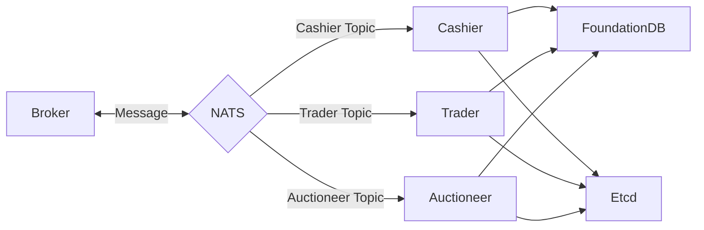

  

# Welcome to Flink
[Flink](https://www.flinkcoin.org) is a next-generation low-latency blockchain platform with high throughput, decentralized exchange, marketplace and integrated common smart contract functionality.

## Flink Highlights

Flink offers the following features

* Zero-fee for main operations
* Very scalable and fast
* Integrated popular smart contracts
* Builtin order book decentralized exchange
* Support for marketplaces and auctions 

Flink is a cutting-edge blockchain platform engineered for unparalleled scalability and speed, surpassing industry benchmarks in performance, cost-effectiveness, programmability, and user-friendliness. As the Flink Mainnet launch draws near, it will showcase transaction processing capabilities that exceed those of existing systems, both traditional and blockchain-based. Flink pioneers a new era of programmable blockchains by achieving internet-scale performance, enabling it to directly compete with established centralized systems.

## Flink Architecture
Flink has a unique architecture that enables it to achieve high throughput and low latency. The architecture is designed to be modular and extensible, allowing for easy integration of new features and optimizations. The key components of the Flink architecture are:

  

## Flink Overview

Flink is a smart contract platform maintained by a permissionless set of authorities that play a role similar to validators or miners in other blockchain systems.

Flink offers scalability and unprecedented low-latency for common use cases. Flink makes the vast majority of transactions processable in parallel, which makes better use of processing resources, and offers the option to increase throughput with more resources. Flink forgoes consensus to instead use simpler and lower-latency primitives for common use cases, such as payment transactions and asset transfers. This is unprecedented in the blockchain world and enables a number of new latency-sensitive distributed applications, ranging from gaming to retail payment at physical points of sale.

Flink is written in [Go](https://go.dev/) and supports smart contracts written in the [Move programming language](https://github.com/move-language/move) to define assets that may have an owner. Move programs define operations on these assets including custom rules for their creation, the transfer of these assets to new owners, and operations that mutate assets.

Flink has a native token called Flink, with a fixed supply. The Flink token is used to pay for gas, and is also used as [delegated stake on authorities](https://learn.bybit.com/blockchain/delegated-proof-of-stake-dpos/) within an epoch. The voting power of authorities within this epoch is a function of this delegated stake. Authorities are periodically reconfigured according to the stake delegated to them. In any epoch, the set of authorities is [Byzantine fault tolerant](https://pmg.csail.mit.edu/papers/osdi99.pdf). At the end of the epoch, fees collected through all transactions processed are distributed to authorities according to their contribution to the operation of the system. Authorities can in turn share some of the fees as rewards to users that delegated stakes to them.

Flink is supported by several cutting-edge [peer-reviewed studies](https://github.com/MystenLabs/Flink/blob/main/docs/content/concepts/research-papers.mdx) and extensive years of open-source development.

## Flink Comparison
  
## More About Flink

Use the following links to learn more about Flink and the Flink ecosystem:

* Learn more about Flink in the [Flink Wiki](https://github.com/flinkcoin/mono/wiki).
* Join the Flink community on [Flink Telegram](https://discord.gg/Flink).
* Find out more about the Flink ecosystem on the [Flink Resources](https://Flink.io/resources/) page.
* Review information about Flink governance, [decentralization](https://Flinkfoundation.org/decentralization), and [Developer Grants Program](https://Flink.io/grants-hub) on the [Flink Foundation](https://Flinkfoundation.org/) site.

